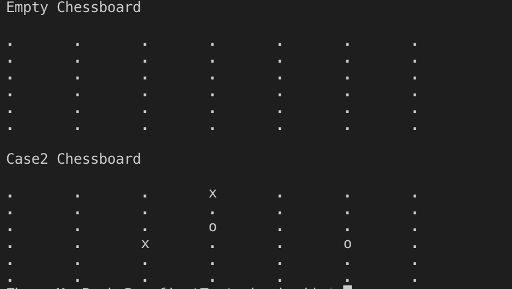
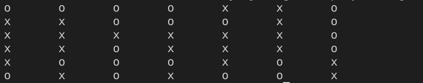
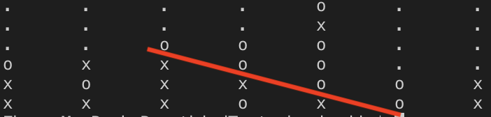
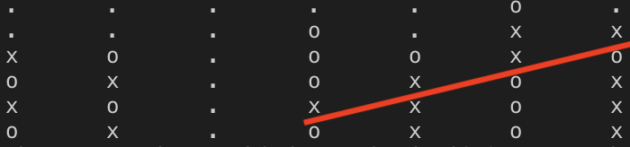
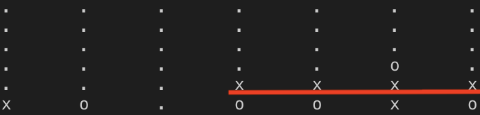
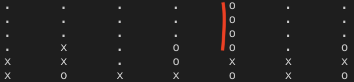

# Turtorial

## Setup

* Install Golang
* Place this project into your {gopath}/src/github.com/

    `git clone https://github.com/ZJJ1991/Ankr.git`

## datastructure Module
This module contains the basic data structures.

## firstTest Module
This module contains the implementations regarding the 1st test. To see the result, run the following command:

`cd firstTest`

`go run chessboard.go`

The result is as follows:

## secondTest Module
This module contains the implementations regarding the 2nd test. To see the result, run the following command:

`cd secondTest`

`go run playChess.go`

The result is as follows:

## thirdTest Module
This module contains the implementations regardigng the 3rd test. To see the result, run the following command:

`cd secondTest`

`go run checkWin.go`

However, there are 4 situations that a player can win:

* situation1

* situation2

* situation3

* situation 4

